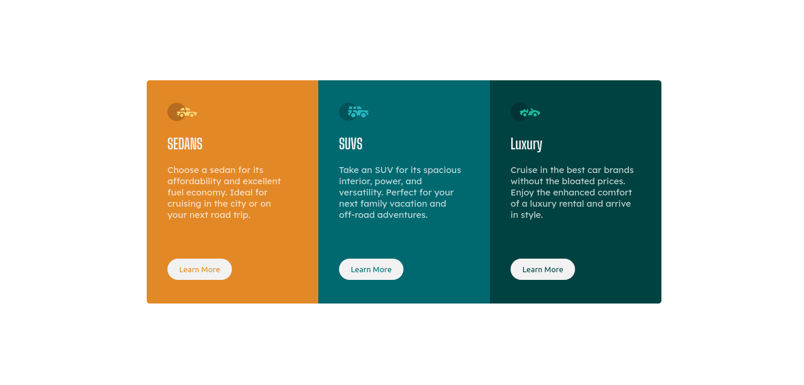

# Frontend Mentor - 3-column preview card component solution

This is a solution to the [3-column preview card component challenge on Frontend Mentor](https://www.frontendmentor.io/challenges/3column-preview-card-component-pH92eAR2-). 
### Screenshot

### Links

- Solution URL: [https://www.frontendmentor.io/solutions/responsive-3-card-component-solution-using-css-grid-mHxoBwZjt3]
- Live Site URL: [https://belkysupreme22.github.io/3-column-preview-card-component.io/]

### Built with

- Semantic HTML5 markup
- CSS Grid
- responsive design for mobile and desktop

## Author

- Website - beamlak
- Frontend Mentor - [@belkysupreme22](https://www.frontendmentor.io/profile/belkysupreme22)

